[](https://twitter.com/deanthecoder)

# DTC.AsciiTheme
Retro ASCII-style UI for Avalonia — recreate classic DOS-era interfaces with modern controls.

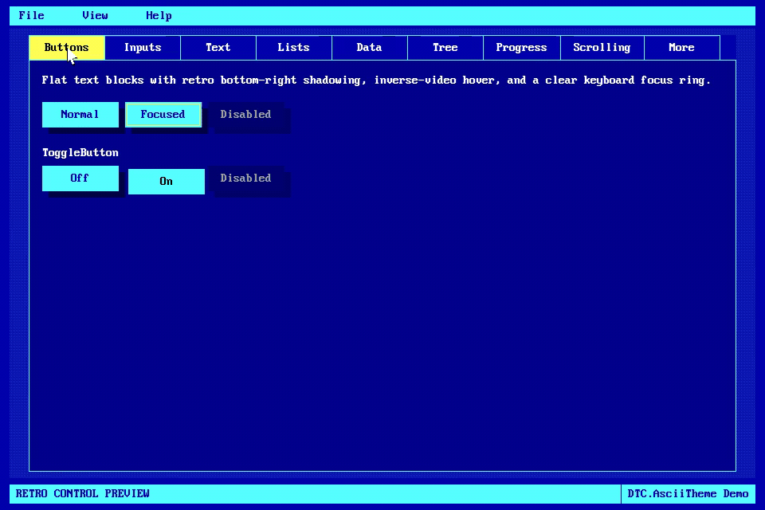

## Why

Modern UI frameworks are great, but sometimes you want something with personality.
DTC.AsciiTheme brings back the clarity, contrast, and nostalgia of DOS-era interfaces,
while keeping all the benefits of Avalonia.

`DTC.AsciiTheme` is primarily a style/theme layer for normal Avalonia controls, so it fits into a regular Avalonia app with very little learning curve. Most of what you use here is still `Button`, `TextBox`, `ComboBox`, `TreeView`, `DataGrid`, and the rest of the standard control set, just re-skinned to feel like classic DOS utilities, BBS tools, setup screens, and text-mode file managers.

The package also includes a small set of helper components where Avalonia doesn’t provide the required shapes out of the box, such as `AsciiGroupBox`, `AsciiStatusBar`, `AsciiMessageBox`, and `AsciiFileDialog`.

## Retro file dialog
The package now also includes a custom retro-styled `AsciiFileDialog.OpenFileAsync(...)` helper for apps that want an in-app DOS-style picker instead of the native platform dialog.

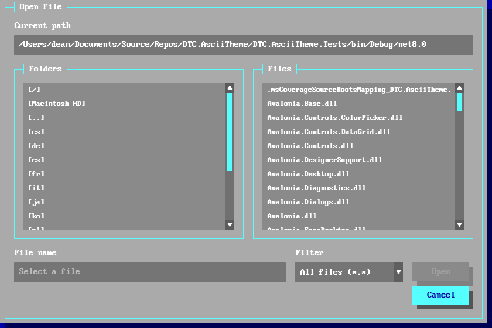

## Demo tabs
### Buttons
Demonstrates `Button` and `ToggleButton`, including hover, focus, disabled, and latched states using the VGA font and retro shadow treatment.

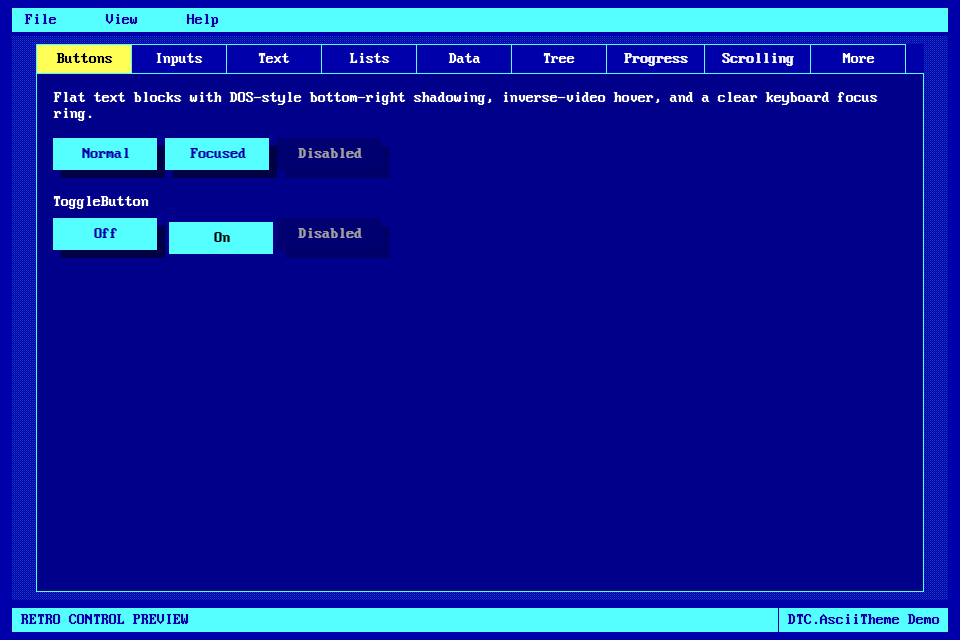

### Inputs
Demonstrates single-line `TextBox`, password entry, a multiline editor with themed scrollbars, `ComboBox`, `NumericUpDown`, `CheckBox`, and `RadioButton`.

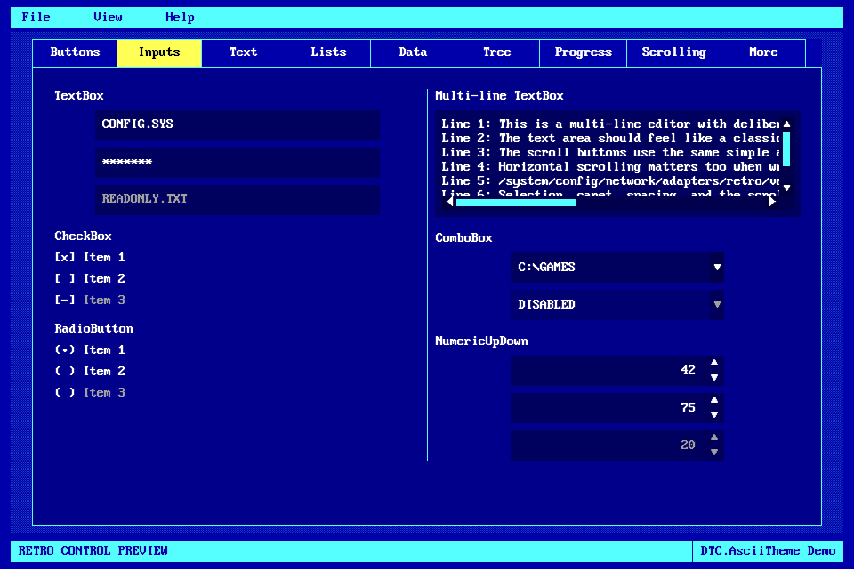

### Text
Demonstrates `TextBlock`, `Label`, and `Separator`, including wrapped copy, headings, and form-style label targeting.


### Lists
Demonstrates `ListBox` together with the custom `AsciiGroupBox` framing and selection styling.

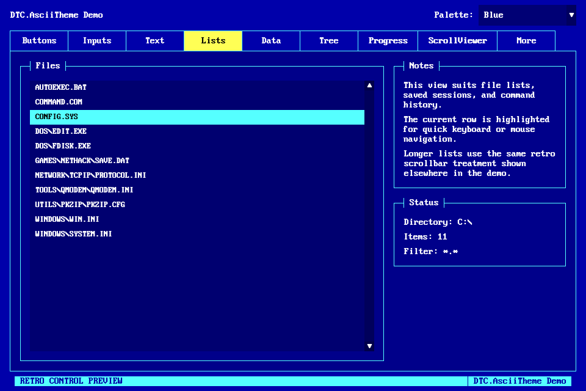

### Data
Demonstrates a first-pass `DataGrid` with ASCII-styled headers, sort arrows, row selection, grid lines, and shared scrollbar treatment.

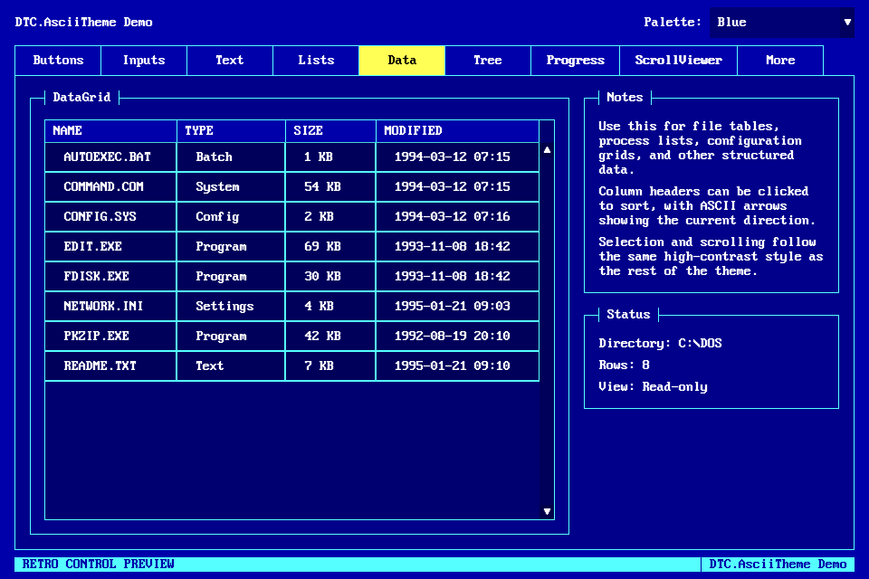

### Tree
Demonstrates `TreeView`, ASCII expand/collapse arrows, selection, and nested hierarchy rendering.

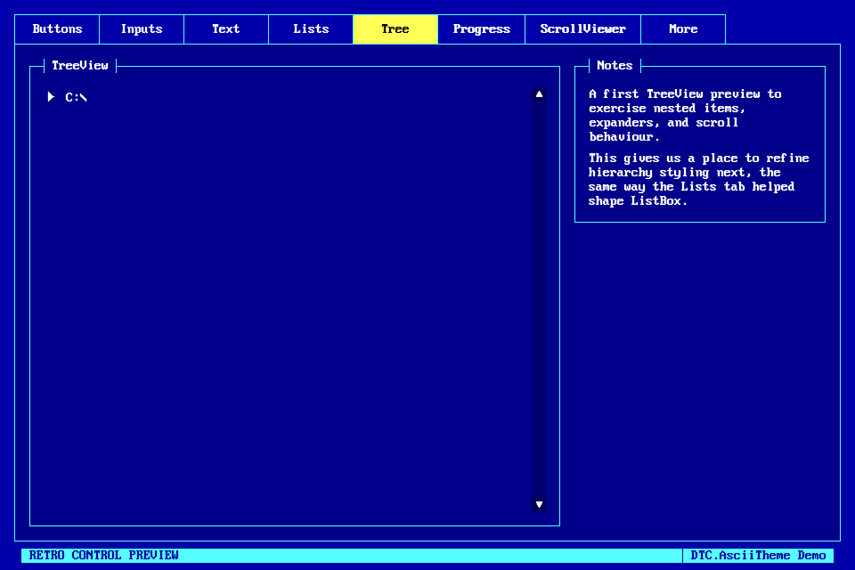

### Progress
Demonstrates horizontal and vertical `ProgressBar`, including animated bars and inline progress text.

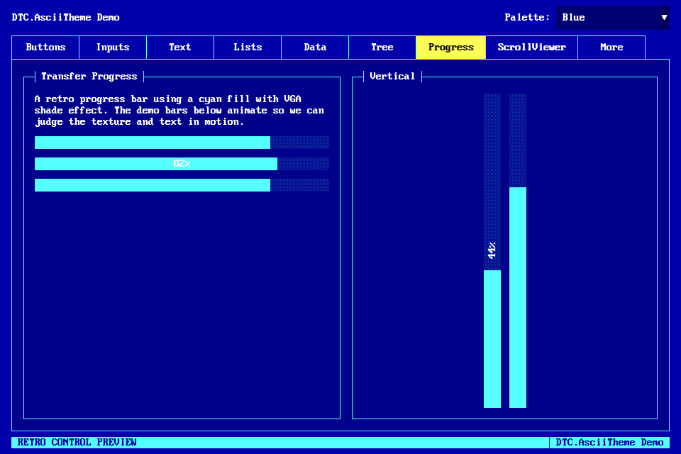

### ScrollViewer

Demonstrates shared `ScrollViewer`/`ScrollBar` styling with a dithered retro image preview.

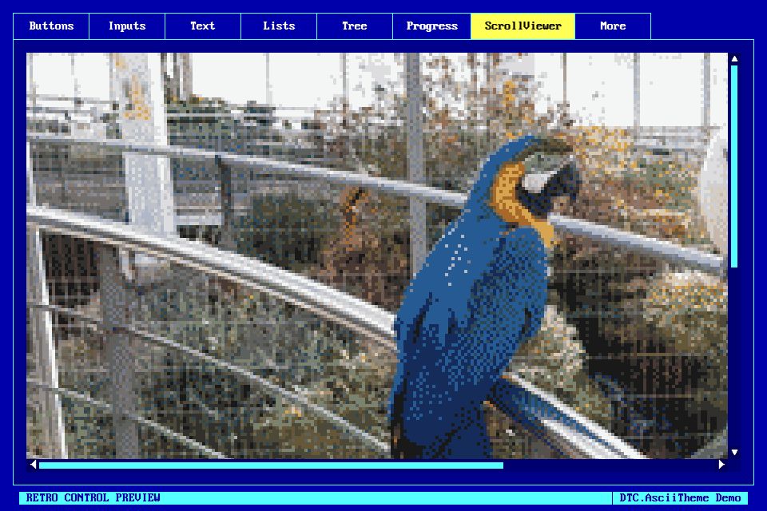

### More
Demonstrates `AsciiMessageBox`, `Expander`, `Slider`, `GridSplitter`, `ToolTip`, and the footer `AsciiStatusBar`. The demo app itself now uses the themed `Menu` at the top level for `File`, `View`, and `Help`.

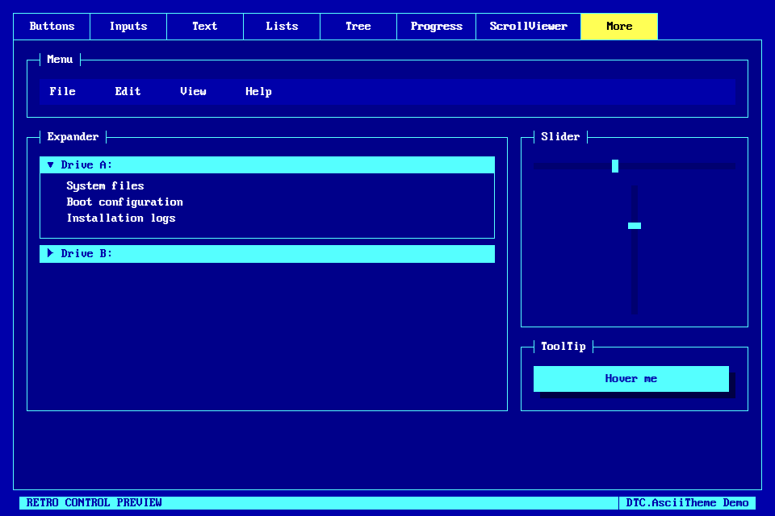

## Retro message box
`AsciiMessageBox` provides a simple in-app retro dialog for `OK`, `OK/Cancel`, `Yes/No`, and `Yes/No/Cancel` flows while keeping the parent window visible behind it.

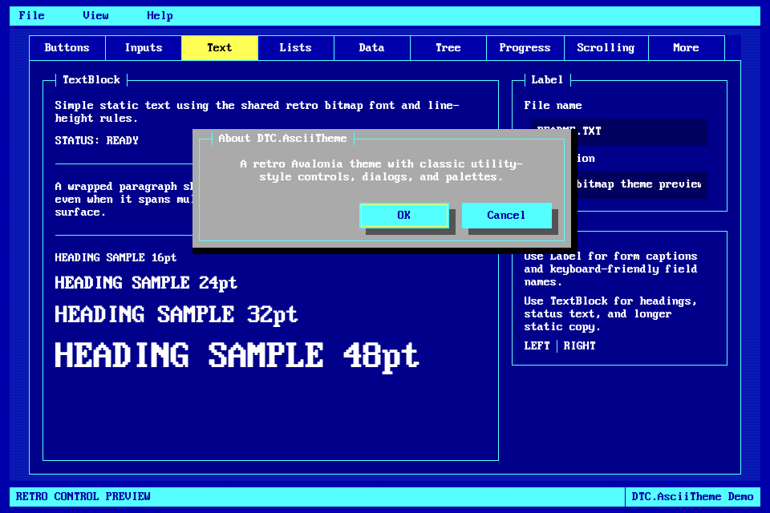

## GitHub 1989 demo window
The demo app includes a themed fake GitHub screen under `Help > GitHub 1989`, intended as a screenshot-friendly retro UI gag that follows the currently selected palette.

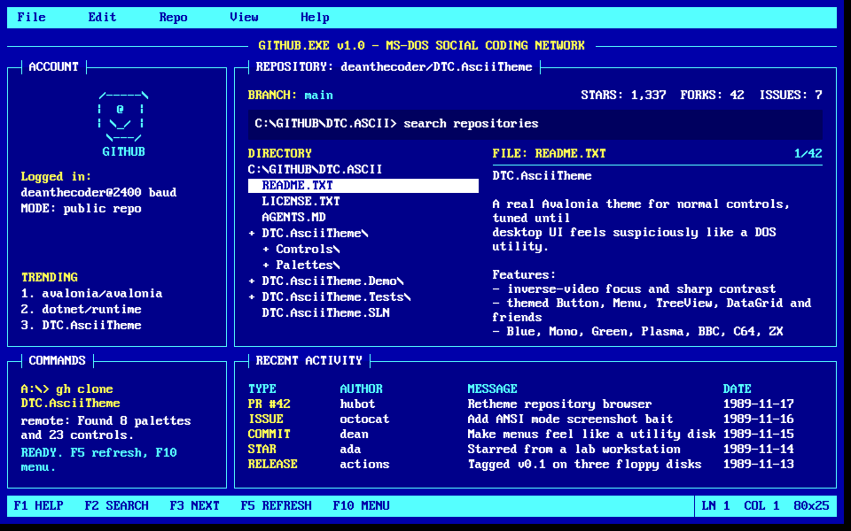

## What it currently styles
### Standard Avalonia controls
- `Button`
- `CheckBox`
- `ComboBox`
- `DataGrid`
- `Expander`
- `GridSplitter`
- `Label`
- `ListBox`
- `Menu`
- `NumericUpDown`
- `ProgressBar`
- `RadioButton`
- `ScrollBar`
- `ScrollViewer`
- `Separator`
- `Slider`
- `TabControl`
- `TextBlock`
- `TextBox`
- `ToggleButton`
- `ToolTip`
- `TreeView`

### Extra retro helper components
- `AsciiGroupBox`
- `AsciiFileDialog`
- `AsciiMessageBox`
- `AsciiStatusBar`

## Build and run
Prereqs: .NET 8 SDK.

```bash
dotnet build DTC.AsciiTheme.sln
dotnet run --project DTC.AsciiTheme.Demo/DTC.AsciiTheme.Demo.csproj
```

## Quick start

Add the theme and you're done:

```xml
<ascii:AsciiTheme />
```

Reference `DTC.AsciiTheme` from your Avalonia app, then load the theme in `App.axaml`:

```xml
<Application xmlns="https://github.com/avaloniaui"
             xmlns:x="http://schemas.microsoft.com/winfx/2006/xaml"
             xmlns:fluent="clr-namespace:Avalonia.Themes.Fluent;assembly=Avalonia.Themes.Fluent"
             xmlns:ascii="using:DTC.AsciiTheme"
             x:Class="YourApp.App">
    <Application.Styles>
        <fluent:FluentTheme />
        <ascii:AsciiTheme />
    </Application.Styles>
</Application>
```

That matches the demo app and gives you the normal Avalonia Fluent baseline plus the retro overrides from this theme package.

Tested with `Avalonia 11.3.12`.

## Optional palette overlays
The base theme ships with a blue DOS-style palette by default, and also includes optional palette overlays you can load after `AsciiTheme`:

- `avares://DTC.AsciiTheme/Palettes/Blue.axaml`
- `avares://DTC.AsciiTheme/Palettes/Mono.axaml`
- `avares://DTC.AsciiTheme/Palettes/Green.axaml`
- `avares://DTC.AsciiTheme/Palettes/Plasma.axaml`
- `avares://DTC.AsciiTheme/Palettes/Grey.axaml`
- `avares://DTC.AsciiTheme/Palettes/BBC.axaml`
- `avares://DTC.AsciiTheme/Palettes/C64.axaml`
- `avares://DTC.AsciiTheme/Palettes/ZX.axaml`

Example:

```xml
<Application.Styles>
    <fluent:FluentTheme />
    <ascii:AsciiTheme />
    <StyleInclude Source="avares://DTC.AsciiTheme/Palettes/Green.axaml" />
</Application.Styles>
```

If you want to switch palettes at runtime from code, use `AsciiPaletteManager.Apply(...)`.

## Palette gallery
The screenshots below all use the same `Text` tab content so the palette differences are easy to compare:

### Blue

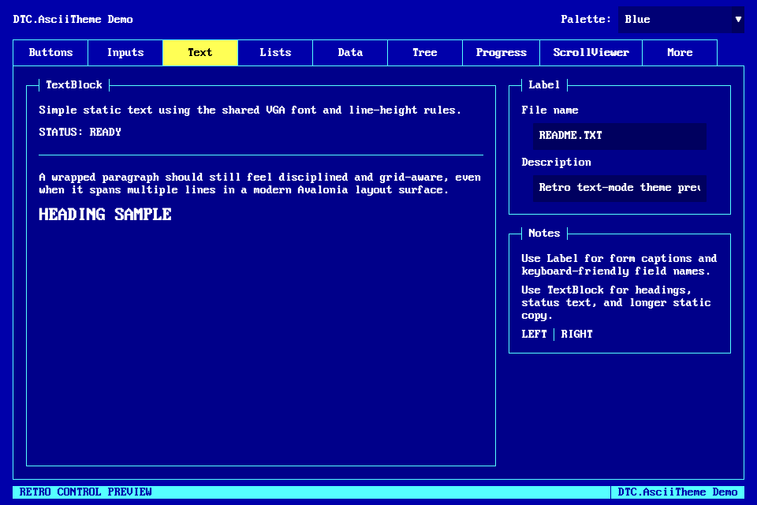

### Mono

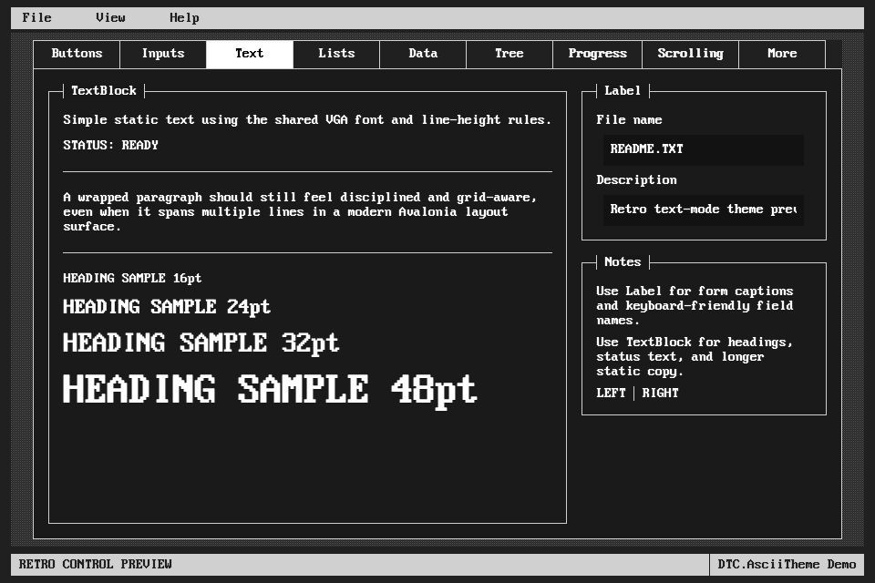

### Green

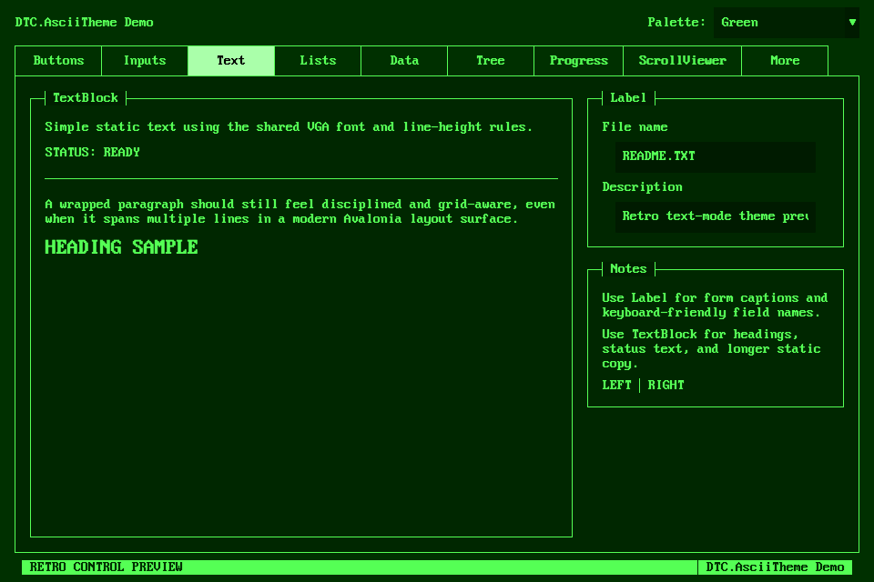

### Plasma

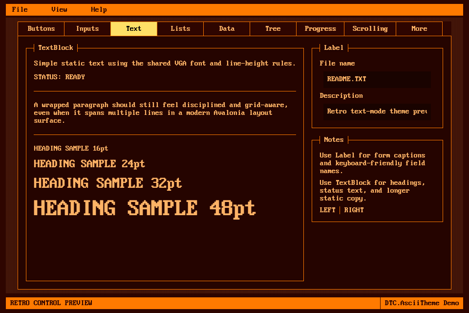

### Grey

Simple light-grey retro palette with black text and strong inverse/highlight states.

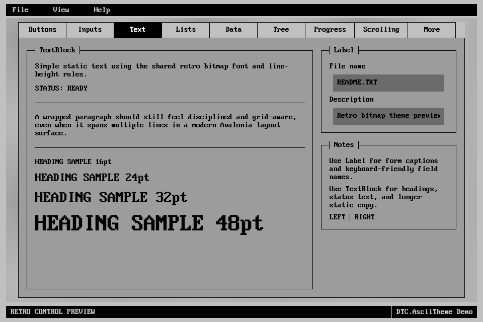

### BBC

Monochrome BBC-style palette using the Commodore bitmap font as a quick retro trial.

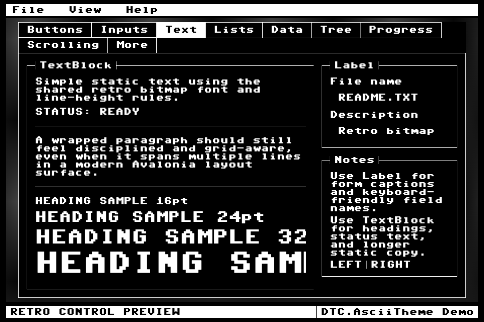

### C64

Commodore-inspired palette using `C64 Pro Mono`.

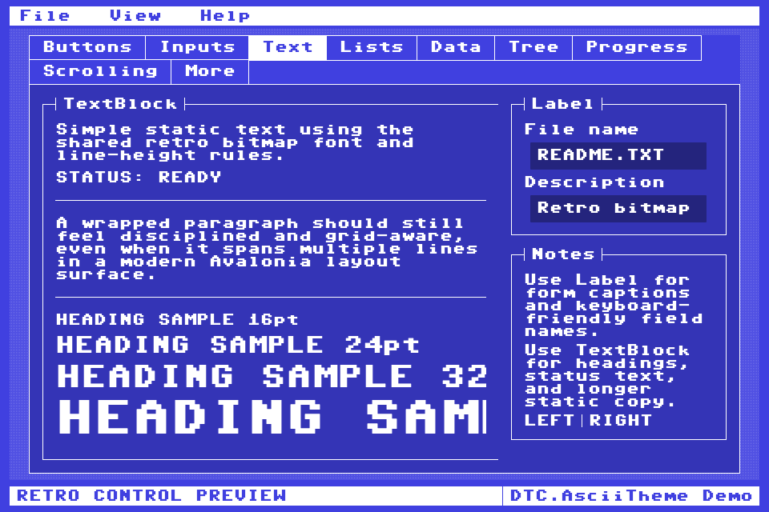

### ZX

Experimental ZX Spectrum-inspired variant using a close Spectrum-style bitmap font.

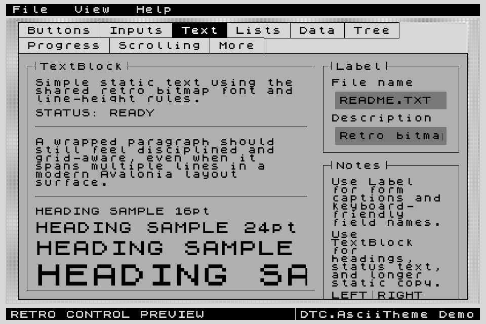

## Project layout
- `DTC.AsciiTheme/` contains the reusable theme library.
- `DTC.AsciiTheme.Demo/` contains the showcase app used for interactive visual checks.
- `DTC.AsciiTheme.Tests/` contains the automated screenshot-generation test.
- `img/` contains the generated demo screenshots used by this README.

## License

Licensed under the MIT License. See [LICENSE](LICENSE) for details.